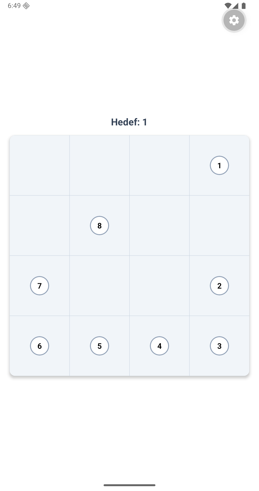
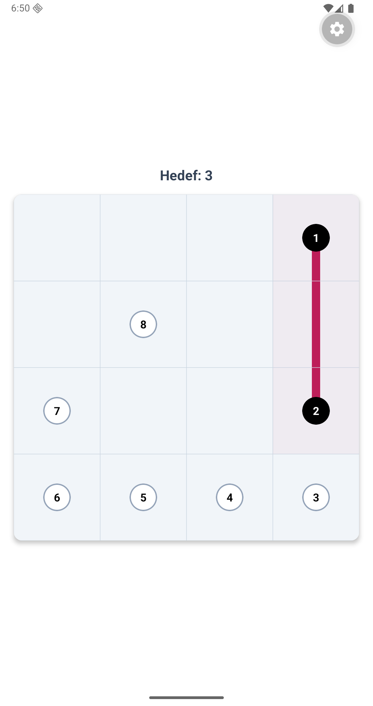
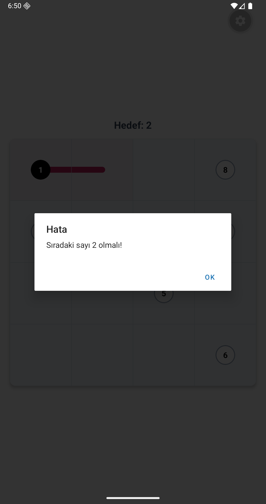
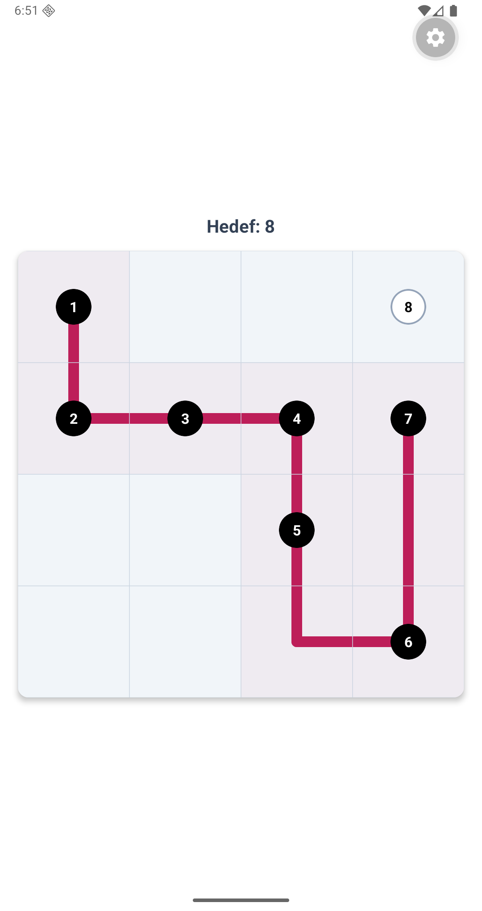
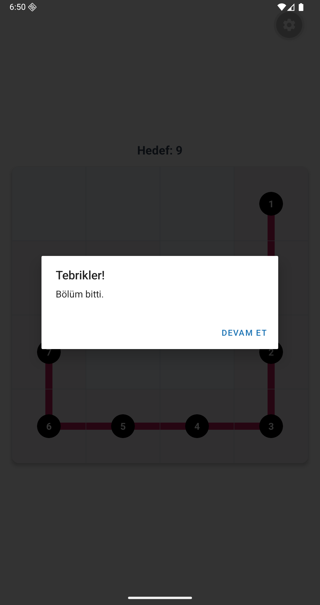

## Kurulum 

Projeyi yerel ortamınızda çalıştırmak veya kütüphaneyi entegre etmek için:

1.  **Depoyu Klonlayın:**
    ```bash
    git clone https://github.com/hasannaysall/ZipGame.git
    cd ZipGame
    ```

2.  **Bağımlılıkları Yükleyin:**
    ```bash
    npm install
    ```

3.  **Native SVG Kütüphanesini Ekleyin:**
4.  
    ```bash
    npx expo install react-native-svg
    ```

---

## Kullanım


```tsx
import { ZipGame } from './ZipGameLibrary';

export default function App() {
  return (
    <View style={{ flex: 1 }}>

      <ZipGame />
    </View>
  );
}
```
---
## Sistem Gereksinimleri

Projeyi yerel ortamınızda sorunsuz çalıştırmak için aşağıdaki araçların yüklü olması önerilir

* **Node.js (v18.x veya üzeri):** JavaScript çalışma ortamı.
* **Git:** Versiyon kontrolü ve projenin klonlanması için.
* **Expo CLI:** Projenin derlenmesi ve sunulması için (`npx expo` komutları için).
* **Expo Go (Mobil Uygulama):** Kodun gerçek bir cihazda anlık olarak test edilmesi için.
* **VS Code:** Önerilen IDE
---
## Uygulama Görselleri

<p align="center">
  
  
  
  
  
</p>
